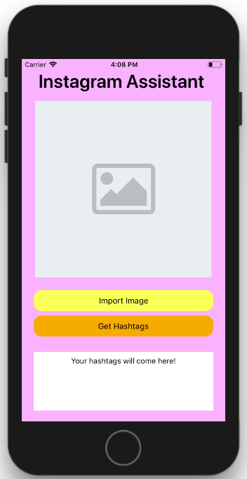
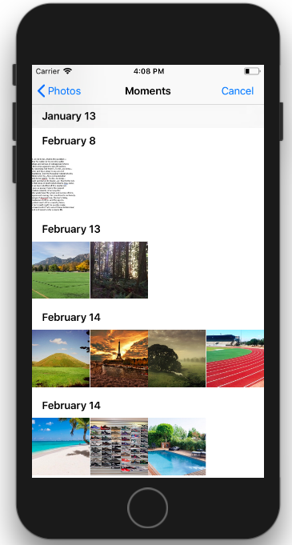
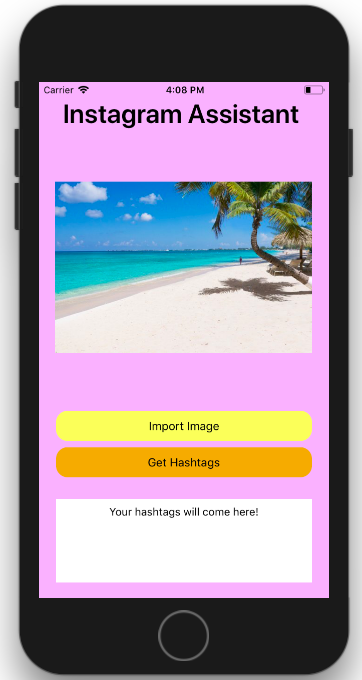
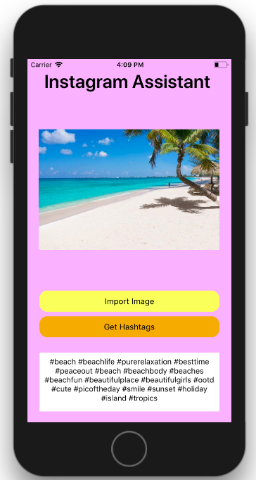

# iOS Hashtag Generator
An iOS application that uses Computer Vision to generate a series of suitable hashtags given an inputted image. The intended audience for this application is companies and Instagram influencers.

**Functionality:**

* Reads in an image from your camera roll

* Generates and displays between 5 to 30 hashtags for the image, given its nature

* Supports over 30 different categories of images

* Currently best used by non-portrait photographers , as it does not recognize humans in context as well as desired, though future updates should improve this

* Utilizes the GooglePlaces205 Machine Learning model

* Has a quick and consise user-interface that is compatible with all hand-held Apple products

**Example Test:**

Hashtags Generated: 

#beach #beachlife #purerelaxation #besttime #peaceout #beach #beachbody #beaches #beachfun #beautifulplace #beautifulgirls #ootd #cute #picoftheday #smile #sunset #holiday #island #tropics

**App Interface:**

